# vbox eta vmware makinak nola IsardVDIra pasatu
Egun erabiltzen ditugun makina gehienak, makina birtualak dira. Eta birtualizazio sistema ezagunenen arten Virtual Box eta VmWare ditugu. Sarri gertatzen zaigu, aurretik dugun makina birtualetako bat IsardVDI mahaigain birtualen sistemara pasatzeko beharra.

Funtsean esaten ari garena zera da: **.OVA** eta **.VMDK** formatodun fitxategiak (virtual Box eta Vmwarek erabiltzen dituztenak), ***QCOW2*** formatura pasatzeaz.
Hau nola egin azaltzen duten webgune asko ditugu, kasuan qcow2 hori, Isard-eko gure mahaigain bihurtuko dugu.

> Hasi aurretik: pauso hauek aurrera eramateko Administradore/root izan beharko gara, bai IsardVDIn baita IsardDVI instalatuta dugun makina fisikoetan. ssh eta scp erabiliko ditugu azpitik sartzeko...

Adibide hontarako [sourceforge.net/projects/metasploitable2-gohack](Metasploitable2-gohack.ova) instalatzea erabaki da.

## Hasi aurretik
Lehenik eta behin, .ova jeitsiko dugu eta  gomendioa bere gainean, klik bikoitza eginaz, abiaraztea.
Kasuan virtual box abiaraziko da.

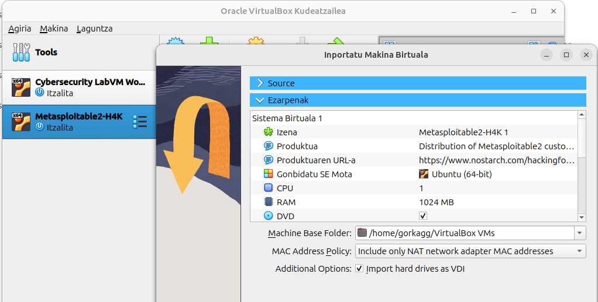 
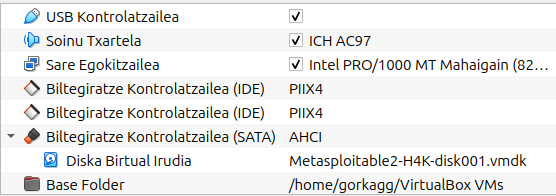 

## 1.- .ova fitxategien edukia erauzi eta qcow2ra bihurtu
**.ova**k trinkotutago fitxategi batzuk besterik ez dira, beraz lehen pausoa, edukia erauztea izango da.

```bash
tar -xvf Metasploitable2-GoHack.ova
```


Erauzi ondoren, irten zaiguna begiratzen badugu, bizpahiru fitxategi agertuko dira eta **.vmdk** formatodun fitxategi bat. Orokorrean *-disk001* (edo horrelako zerbait) izango du vmdk fitxategiak bere izenean gehituta. Gurean **Metasploitable2-H4K-disk001.vmdk** gelditu zaigu

Hau da qcow2-ra pasa beharko duguna.

```bash
qemu-img convert -f vmdk -O qcow2 Metasploitable2-H4K-disk001.vmdk Metasploitable2-H4K.qcow2 
```

Hemen dugu honen guztiaren kaptura:
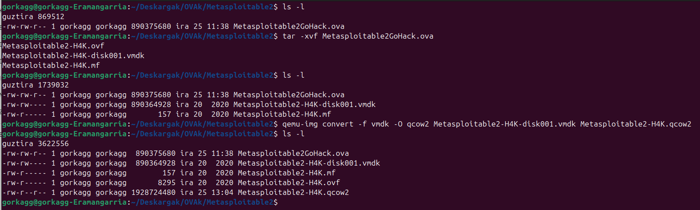

## 2-. .qcow2-ak IsardVDI instalatuta dugun makinara pasatu

Orainarte gure ordenagailuan ibili gara, orain lortu berri dugun qcow2 hau IsardVDI sistemara eramango dugu ssh/scp komandoak erabiliz.

IsardVDI orokorrean /opt barruan instalatzen da, *isard* karpeta sortuaz. Ziurtatu (ssh bitartez sartua) bakoitzaren sisteman konkretuki non dagoen. Gure kasuan *nodo2.uni.eus* izeneko ordenagailuan dugu IsardVDI.
Garbiago ikusteko bi pausotan egingo dugu: lehenik /opt karpetara eta ondoren bere (izen berri eta) kokapen definitibora.

```bash
scp Metasploitable2-H4K.qcow2 root@nodo2.uni.eus:/opt 
```

> Adibidean zenbait md5sum hash kalkulatzen joan naiz irakurleak fitxategiaren pista galdu ez dezan, sistemaz edo izenez aldatu arren

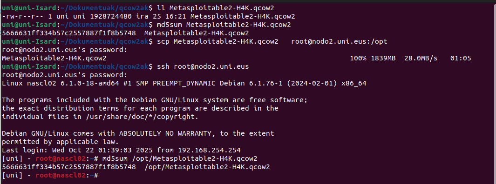

## 3-. IsardVDI sisteman ordezkatuko dugun mahaigaina sortu

Kasuan Metasploitable2 pasatzera goaz, eta 1. irudian ikusi dugu zer ezaugarri dituen makina horrek beraz IsardVDI barruan ezaugarri horiek dituen mahaigain bat sortuko dugu.
Gure kasuan mahaigain berriaren izena UbuntuaMetasplotablera da eta vCPU 1 eta 2GB memoria izango ditu.

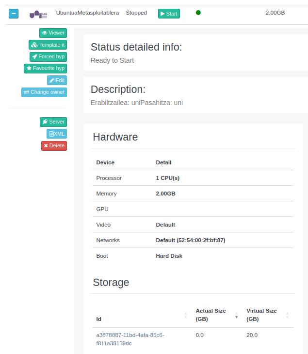

Aurreko kapturan guretako OSO garrantzitsua den beste datu bat ere agertzen da: Storage atalean, sortu berri den mahaigainaren diskoak zer izen (id) duen ikusten dugu, kasuan *a3878887-11bd-4afa-85c6-f811a38139dc*

## 4-. Ekarri dugun makinaren diskoarekin, sortu berri dugun qcow2a zanpatu

IsardVDIn orokorrean disko guztiak groups karpetan daude beraz isard-en sortu berri dugun mahaigainaren qcow2 diskoa /opt/isard/groups karpetan egongo da.
Lehenik begiratu/bilatu egingo dugu eta ondoren kanpotik ekarri dugunarekin zanpatu.
*/opt* karpetan bagaude...

```bash
mv Metasploitable2-H4K.qcow2 isard/groups/a3878887-11bd-4afa-85c6-f811a38139dc.qcow2
```

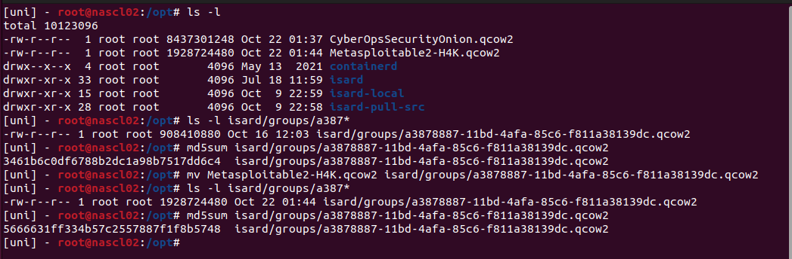

Irudian ikus daiteke nola zanpatu dugun qcow2a. qcow2aren *md5sum* berria, kanpotik sartu dugun Metasploitable2aren *md5sum*a da jada!

## 5-. Eta jada martxan!

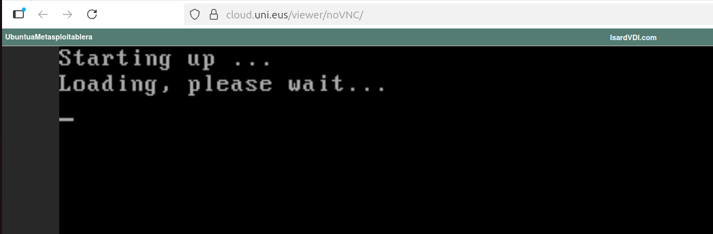

Egia esan hemen hasten da egindako lanaren emaitza hartzeko unea. **Kasuen %80-90 guztia ondo dago eta gure mahaigain berria martxan da**, baina hasierako makina birtualak dituen ezaugarrien arabera arazo txiki batzuk sor daitezke.
Adibide honen kasuan emaitza...

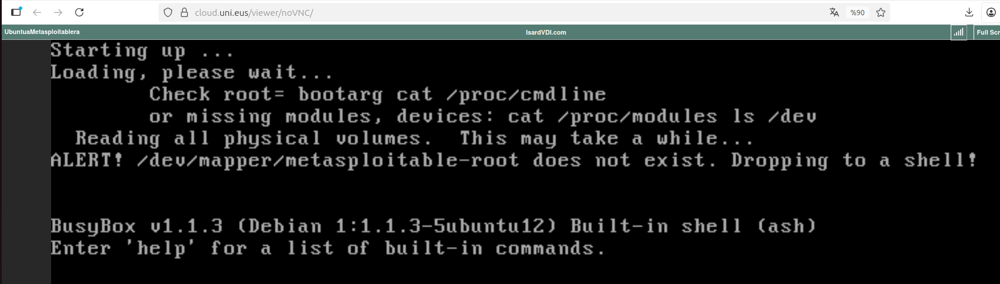

Orduan 1. irudira begiratu eta makina originalaren ezaugarriak begiratu ditut. Eta hara non, diskoa SATA dela ikusten dudan eta hemen sortutako mahaigainekoa IDE.
Mahaigaina editatu, **diskoa SATA** dela esan eta alehop! 

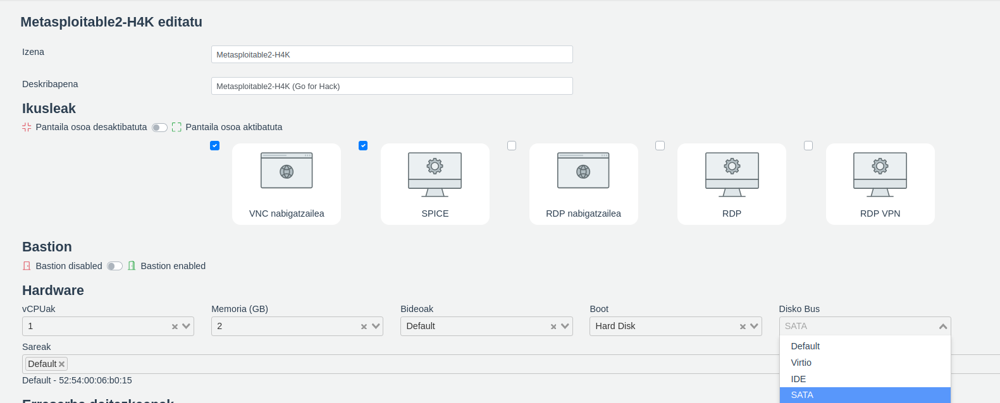

Aldaketan gorde, mahaigaina berriz abiarazi eta...

Martxan!
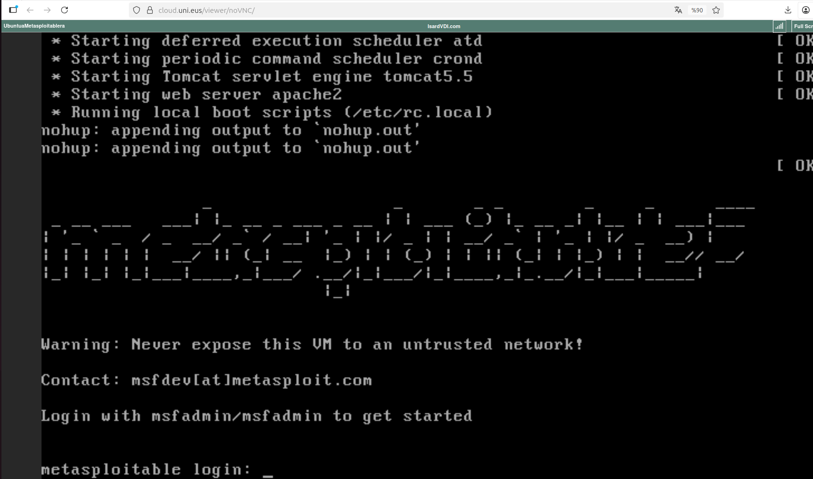

### 5.1 Eta arazo gehiago baleude...

Baliteke oraindik ere ezin abiaraztea. Nondik jo?
IsardVDIko mahaigainek Administrazio ataletik editatzean, badute konfigurazio XMLa eta berau eskuz aldatzen has gaitezke.

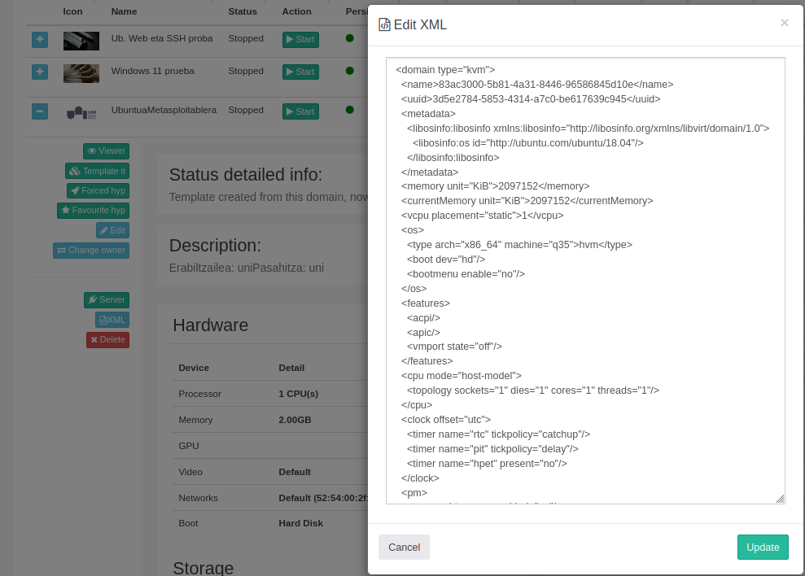

## 6-. Txantiloi bihurtu

Azken pausoa, mahaigain hau txantiloi bihurtzea litzake, dagokion izena eman (Metasploitable2), baimenak... eta ondoren jendeak erabil dezala.

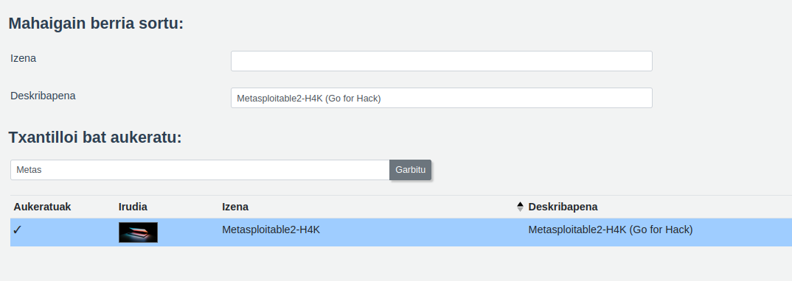

> Inor adibide konkretu hau jarraitzen ari bada Metasploitable2 erabiliz, guri azken arazo bat sortu zitzaigun: erabiltzera gindoazenean (mahaigaina jada ondo piztuta), ez zuen sarerik ikusten. Oraingoan konponbidea (eta arazoa) Isard-en sare modeloetan dago: Jarrita genuen openVSwitch->*virtio* sarea ez zuen ikusten, *e100* jarri genuenean, dena ondo. 
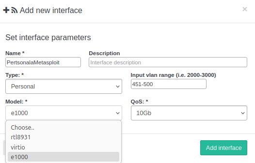

Bukatzeko, aholku orokor gisa, **hasieran, aukeratu dugun makinaren ezaugarriak ondo begiratu, gero IsardVDI plataforman mahaigaina doitzen joateko.**
